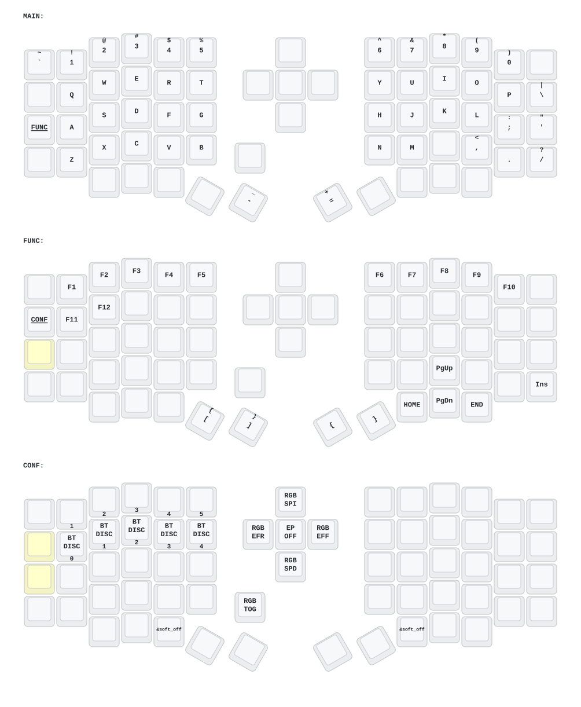

# 自定义 ZMK Sofle 配列

基于上游项目 [`a741725193/zmk-sofle`](https://github.com/a741725193/zmk-sofle)，保留原来的 `Sofle` 设备名称和自定义三层配列，并接入 DYA Studio。

## 配置键盘

- 使用 [DYA Studio](https://studio.dya.cormoran.works/) 通过 USB 连接键盘，可以运行时修改键位和旋钮行为，并管理蓝牙 Profile。
- 使用 [ZMK Keymap Editor](https://nickcoutsos.github.io/keymap-editor/) 修改仓库中的默认键位配置。

DYA Studio 中保存到键盘 Flash 的设置在正常断电和重启后仍然有效，但不会自动回写到本仓库的 `config/custom_sofle.keymap`。

## 默认键位图

